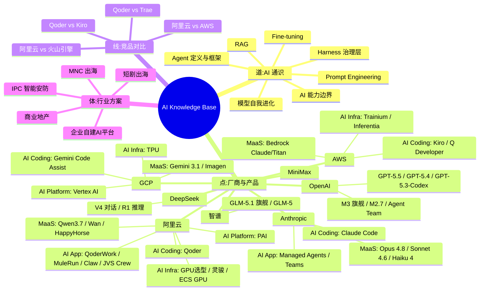

# 🧠 AI Knowledge Base

> AI Native 领域结构化知识库 — 双 Agent 驱动，持续进化

<p align="center">
  <a href="index.md"></a>
  <a href="#-快速导航"></a>
  <a href="#-精华速览"></a>
  <a href="#-知识全景"></a>
</p>

---

## 🧭 快速导航

> 想找什么？点这里。

| 我想了解… | 入口 |
|-----------|------|
| 模型能力 / 定价 / 对比 | [Qwen](knowledge/alibaba-cloud/maas/qwen.md) · [Claude](knowledge/anthropic/maas/claude-api.md) · [GPT-5](knowledge/openai/gpt-5-series.md) · [Gemini](knowledge/gcp/maas/gemini.md) · [GLM](knowledge/zhipu/glm-series.md) · [MiniMax](knowledge/minimax/minimax-series.md) · [DeepSeek](knowledge/deepseek/general_intro.md) |
| 文生图 / 视频生成 | [Wan](knowledge/alibaba-cloud/maas/wan.md) · [HappyHorse](knowledge/alibaba-cloud/maas/happyhorse.md) · [Imagen](knowledge/gcp/maas/imagen.md) |
| AI Coding 工具 | [Qoder](knowledge/alibaba-cloud/ai-coding/qoder.md) · [Claude Code](knowledge/anthropic/ai-coding/claude-code.md) · [Kiro](knowledge/aws/ai-coding/kiro.md) · [Gemini Code Assist](knowledge/gcp/ai-coding/gemini-code-assist.md) |
| AI 应用平台 | [QoderWork](knowledge/alibaba-cloud/ai-application/qoder-work.md) · [MuleRun](knowledge/alibaba-cloud/ai-application/mulerun.md) · [Claw](knowledge/alibaba-cloud/ai-application/claw-family.md) · [Claude Teams](knowledge/anthropic/ai-application/claude-teams.md) |
| GPU / AI 基础设施 | [GPU 选型](knowledge/alibaba-cloud/ai-infra/gpu-product-line.md) · [灵骏](knowledge/alibaba-cloud/ai-infra/lingjun.md) · [Trainium](knowledge/aws/ai-infra/trainium.md) · [TPU](knowledge/gcp/ai-infra/tpu.md) |
| 竞品对比 | [Qoder vs Kiro](knowledge/alibaba-cloud/competitive-analysis/qoder-vs-kiro/overview.md) · [Qoder vs Trae](knowledge/alibaba-cloud/competitive-analysis/qoder-vs-trae/overview.md) · [阿里云 vs AWS](knowledge/alibaba-cloud/competitive-analysis/alibaba-vs-aws/overview.md) · [阿里云 vs 火山引擎](knowledge/alibaba-cloud/competitive-analysis/alibaba-vs-volcengine/overview.md) |
| AI 通识概念 | [Agent](knowledge/ai-general-notes/agent-def.md) · [Harness](knowledge/ai-general-notes/harness.md) · [Prompt](knowledge/ai-general-notes/prompt-engineering.md) · [RAG](knowledge/ai-general-notes/rag.md) · [Fine-tuning](knowledge/ai-general-notes/fine-tuning.md) |
| 行业方案 | [企业 AI 平台](knowledge/solutions/enterprise-ai-platform/overview.md) · [短剧出海](knowledge/solutions/vertical-short-drama/overview.md) · [商业地产](knowledge/solutions/commercial-real-estate/overview.md) · [IPC 安防](knowledge/solutions/vertical-ipc/overview.md) |

---

## ⭐ 精华速览

> 新读者从这 9 篇开始，10 分钟建立 AI 技术全景认知。

### 🧠 通识基石

| 文档 | 一句话价值 |
|------|-----------|
| [Agent 定义与框架](knowledge/ai-general-notes/agent-def.md) | Agent 的 for 循环本质、Model+Harness 框架、平台战略拐点 |
| [Harness 治理层](knowledge/ai-general-notes/harness.md) | 企业战略级资产、约束治理层、调用层容量与限流治理 |
| [Prompt Engineering](knowledge/ai-general-notes/prompt-engineering.md) | 防幻觉四层机制、第一性原理、博弈论应用 |
| [AI 能力边界](knowledge/ai-general-notes/ai-capability-and-deployment.md) | 锯齿状能力边界、迭代部署哲学、Personal AGI 终局 |
| [模型自我进化](knowledge/ai-general-notes/agent-self-evolution.md) | MiniMax M2.7 实践：模型自主驱动训练，100+ 迭代 30% 提升 |

### 🏭 产品实战

| 文档 | 一句话价值 |
|------|-----------|
| [GPU 产品线选型](knowledge/alibaba-cloud/ai-infra/gpu-product-line.md) | 阿里云 GPU 全线产品对比 + 场景选型决策树 |
| [企业自建 AI 平台](knowledge/solutions/enterprise-ai-platform/overview.md) | Higress AI 网关 + 灵骏 GPU + 百炼 Fallback 完整方案 |
| [Qoder vs Trae](knowledge/alibaba-cloud/competitive-analysis/qoder-vs-trae/overview.md) | 企业级 vs 个人开发者 AI Coding 定位差异 |
| [MiniMax Agent Team](knowledge/minimax/agent-team.md) | Leader–Worker–Verifier 对抗制衡、多 Agent runtime 设计哲学 |

---

## 📊 知识全景



---

## 🏗️ 知识生产流水线


| Agent | 角色 | 触发词 |
|-------|------|--------|
| 🧠 **ai-native-expert** | 联网深度分析 AI 问题，产出 inbox 素材 | 模型对比、选型、API 问题、竞品分析 |
| ⛏️ **ai-knowledge-miner** | 提炼 inbox/notes 为结构化知识文档 | 提炼、沉淀、处理 inbox、knowledge miner |

---

## 📂 目录结构

```
.
├── inbox/              ← 📥 原始素材暂存（处理后自动归档）
├── notes/              ← 📝 长期笔记（销售洞察、Daily Note）
├── archive/            ← 🗄️ 已处理素材备份
├── knowledge/          ← 🎯 结构化知识库（72 篇，含模板）
│   ├── ai-general-notes/   ← 🧠 AI 通识（9 篇：Agent / Harness / Prompt / RAG…）
│   ├── alibaba-cloud/      ← ☁️ 阿里云（20 篇：MaaS / Coding / App / Infra / 竞品分析）
│   ├── aws/                ← 🔶 AWS（10 篇：MaaS / Coding / App / Infra / Platform）
│   ├── gcp/                ← 🔷 GCP（7 篇：MaaS / Coding / App / Infra / Platform）
│   ├── anthropic/          ← 🟠 Anthropic（5 篇：MaaS / Coding / App）
│   ├── minimax/            ← 🟣 MiniMax（3 篇：公司分析 / 模型系列 / Agent Team）
│   ├── deepseek/           ← 🔵 DeepSeek（3 篇：公司分析 / V系列 / R系列）
│   ├── openai/             ← 🟢 OpenAI（2 篇：公司分析 / GPT-5系列）
│   ├── zhipu/              ← 🟡 智谱 AI（2 篇：公司分析 / GLM系列）
│   └── solutions/          ← 🏭 行业方案（7 篇：企业AI平台 / 短剧出海 / IPC…）
├── vibeproject/        ← 🧪 实验代码（Demo 脚本、压测工具）
├── index.md            ← 📋 全局索引导航
└── README.md
```