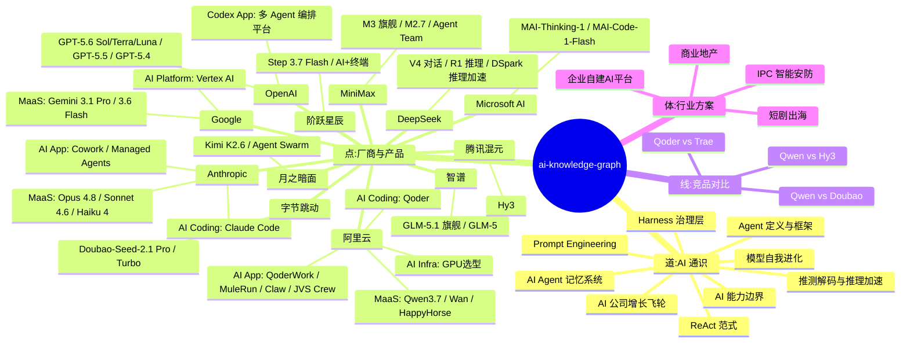

# 🌐 ai-knowledge-graph

> **AI 解决方案售前知识库** — 模型选型 · 竞品对比 · 行业方案 · 技术通识，一站式参考

<table align="center">
<tr>
<td align="center" width="25%"><br><h2>13</h2><b>覆盖厂商</b><br><sub>阿里 · Google · Anthropic · OpenAI…</sub><br><br></td>
<td align="center" width="25%"><br><h2>76</h2><b>结构化文档</b><br><sub>深度分析 · 持续更新</sub><br><br></td>
<td align="center" width="25%"><br><h2>4</h2><b>知识维度</b><br><sub>通识 · 产品 · 对比 · 方案</sub><br><br></td>
<td align="center" width="25%"><br><h2>☁️</h2><b>阿里云为核心</b><br><sub>MaaS · Coding · App · Infra</sub><br><br></td>
</tr>
</table>

<p align="center">
  <a href="index.md"></a>
  <a href="#-快速导航"></a>
  <a href="#-精华速览"></a>
  <a href="#-知识全景"></a>
</p>

---

## 🧭 快速导航

<table>
<tr>
<td width="50%" valign="top">

**☁️ 阿里云 AI 全栈**
> 30 篇 · MaaS / Coding / App / Infra / 行业方案 全链路

[百炼](alibaba-ai-hub/maas/overview.md) · [Qwen](alibaba-ai-hub/maas/qwen.md) · [Wan](alibaba-ai-hub/maas/wan.md) · [HappyHorse](alibaba-ai-hub/maas/happyhorse.md) · [Qoder](alibaba-ai-hub/ai-coding/qoder.md) · [QoderWork](alibaba-ai-hub/ai-application/qoder-work.md) · [MuleRun](alibaba-ai-hub/ai-application/mulerun.md) · [Claw](alibaba-ai-hub/ai-application/claw-family.md) · [GPU](alibaba-ai-hub/ai-infra/gpu-product-line.md)

</td>
<td width="50%" valign="top">

**🔀 竞品对比**
> SA 打法建议 + 差异化分析

[Qoder vs Trae](alibaba-ai-hub/competitive-analysis/qoder-vs-trae/overview.md) · [Qwen vs Hy3](alibaba-ai-hub/competitive-analysis/qwen-vs-hy3/overview.md) · [Qwen vs Doubao](alibaba-ai-hub/competitive-analysis/qwen-vs-doubao/overview.md)

</td>
</tr>
<tr>
<td width="50%" valign="top">

**🏷️ 模型选型与定价**
> 10+ 厂商模型能力 / 定价 / 定位

[Qwen](alibaba-ai-hub/maas/qwen.md) · [Claude](knowledge/anthropic/claude-api.md) · [GPT-5](knowledge/openai/gpt-5-series.md) · [Gemini](knowledge/google/maas/gemini.md) · [Doubao](knowledge/bytedance/doubao-seed-2.1.md) · [GLM](knowledge/zhipu/glm-series.md) · [MiniMax](knowledge/minimax/minimax-series.md) · [DeepSeek](knowledge/deepseek/general_intro.md) · [Kimi](knowledge/moonshot/kimi-k-series.md) · [MAI](knowledge/microsoft/mai-models.md) · [StepFun](knowledge/stepfun/step-3-series.md)

</td>
<td width="50%" valign="top">

**🏭 行业方案**
> 可落地的端到端解决方案

[企业 AI 平台](alibaba-ai-hub/ai-industry-solutions/enterprise-ai-platform/overview.md) · [短剧出海](alibaba-ai-hub/ai-industry-solutions/vertical-short-drama/overview.md) · [商业地产](alibaba-ai-hub/ai-industry-solutions/commercial-real-estate/overview.md) · [IPC 安防](alibaba-ai-hub/ai-industry-solutions/vertical-ipc/overview.md)

</td>
</tr>
<tr>
<td width="50%" valign="top">

**⌨️ AI Coding & App**
> IDE 插件 · 桌面 Agent · 云端编排

[Qoder](alibaba-ai-hub/ai-coding/qoder.md) · [Claude Code](knowledge/anthropic/claude-code.md) · [Codex](knowledge/openai/codex.md) · [QoderWork](alibaba-ai-hub/ai-application/qoder-work.md) · [MuleRun](alibaba-ai-hub/ai-application/mulerun.md) · [Claude Cowork](knowledge/anthropic/claude-cowork.md)

</td>
<td width="50%" valign="top">

**📚 AI 通识**
> Agent · Harness · Prompt · Benchmark

[Agent](knowledge/ai-general-notes/agent-def.md) · [Harness](knowledge/ai-general-notes/harness.md) · [Prompt](knowledge/ai-general-notes/prompt-engineering.md) · [Benchmark](knowledge/ai-general-notes/benchmark-coding-agentic.md) · [ReAct](knowledge/ai-general-notes/Memory-ReAct.md) · [长程任务](knowledge/ai-general-notes/long-horizon-task.md) · [推测解码](knowledge/ai-general-notes/speculative-decoding.md) · [前沿模型](knowledge/ai-general-notes/frontier-model-positioning.md)

</td>
</tr>
</table>

---

## ⭐ 精华速览

> 新读者从这 12 篇开始，10 分钟建立 AI 技术全景认知。

### 🟧 阿里云产品实战

| 文档 | 一句话价值 |
|------|-----------|
| [百炼平台](alibaba-ai-hub/maas/overview.md) | UID 级限流、多账号扩 TPM（8.5× 实测）、deepseek-v4-flash 压测 |
| [百炼安全合规](alibaba-ai-hub/maas/model_studio_security-compliance_cn.md) | SOC 2 / ISO 42001 / CMaaS / Geo-fencing，企业级安全应答 |
| [Qwen3.7 系列](alibaba-ai-hub/maas/qwen.md) | Max（编码旗舰）/ Plus（性价比）/ 3.6（轻量），1M 上下文 |
| [万相 Wan2.7](alibaba-ai-hub/maas/wan.md) | 视频生成旗舰、首尾帧控制、费用估算 |
| [Qoder](alibaba-ai-hub/ai-coding/qoder.md) | 企业级 AI Coding IDE，vs Claude Code / Trae 定位差异 |
| [GPU 产品线选型](alibaba-ai-hub/ai-infra/gpu-product-line.md) | 阿里云 GPU 全线产品对比 + 场景选型决策树 |
| [企业自建 AI 平台](alibaba-ai-hub/ai-industry-solutions/enterprise-ai-platform/overview.md) | Higress AI 网关 + 灵骏 GPU + 百炼 Fallback 完整方案 |
| [Qoder vs Trae](alibaba-ai-hub/competitive-analysis/qoder-vs-trae/overview.md) | 企业级 vs 个人开发者 AI Coding 定位差异 |

### 🟦 通识基石

| 文档 | 一句话价值 |
|------|-----------|
| [Agent 定义与框架](knowledge/ai-general-notes/agent-def.md) | Agent 的 for 循环本质、Model+Harness 框架、平台战略拐点 |
| [Harness 治理层](knowledge/ai-general-notes/harness.md) | 企业战略级资产、约束治理层、调用层容量与限流治理 |
| [Prompt Engineering](knowledge/ai-general-notes/prompt-engineering.md) | 防幻觉四层机制、第一性原理、博弈论应用 |
| [AI 能力边界](knowledge/ai-general-notes/ai-capability-and-deployment.md) | 锯齿状能力边界、迭代部署哲学、Personal AGI 终局 |
| [模型自我进化](knowledge/ai-general-notes/agent-self-evolution.md) | MiniMax M2.7 实践：模型自主驱动训练，100+ 迭代 30% 提升 |
| [AI Agent 记忆系统](knowledge/ai-general-notes/agent-memory.md) | ChatGPT Dreaming V3、人脑记忆工程同构、个性化护城河 |
| [ReAct 范式](knowledge/ai-general-notes/Memory-ReAct.md) | Reasoning and Acting 范式，LLM Agent 最小可行范式，Memory 是最后一公里 |
| [AI 公司增长飞轮](knowledge/ai-general-notes/ai-company-growth-flywheel.md) | Killer App × 企业信任 × 消费制收入，Anthropic 17 个月 47 倍 |
| [AI Agent Benchmark](knowledge/ai-general-notes/benchmark-coding-agentic.md) | 三维度评估框架：操作执行力（SWE-bench/TB/OSWorld）+ 学术推理力（HLE）+ 知识工作力（GDPval-AA） |

### 🔵 他厂精选

| 文档 | 一句话价值 |
|------|-----------|
| [MiniMax Agent Team](knowledge/minimax/agent-team.md) | Leader–Worker–Verifier 对抗制衡、多 Agent runtime 设计哲学 |

---

## ☁️ 阿里云 AI 全栈速览

> **30 篇深度文档，覆盖从底层算力到上层应用的完整 AI 产品矩阵（含行业方案）。**

| 层级 | 核心产品 | 快速入口 |
|------|---------|---------|
| 🧠 **MaaS 模型即服务** | 百炼 · Qwen3.7 · Wan2.7 · HappyHorse · Fun-Music | [百炼](alibaba-ai-hub/maas/overview.md) · [Qwen](alibaba-ai-hub/maas/qwen.md) · [Wan](alibaba-ai-hub/maas/wan.md) · [HappyHorse](alibaba-ai-hub/maas/happyhorse.md) · [Fun-Music](alibaba-ai-hub/maas/fun-music.md) · [售前工具](alibaba-ai-hub/maas/sales-tools/) |
| ⌨️ **AI Coding** | Qoder（企业级 AI Coding） | [Qoder](alibaba-ai-hub/ai-coding/qoder.md) · [Qoder 架构分析](alibaba-ai-hub/ai-coding/qoder_survey_20260622.md) · [vs Trae](alibaba-ai-hub/competitive-analysis/qoder-vs-trae/overview.md) |
| 🤖 **AI 应用平台** | QoderWork · MuleRun · Claw · JVS Crew | [QoderWork](alibaba-ai-hub/ai-application/qoder-work.md) · [MuleRun](alibaba-ai-hub/ai-application/mulerun.md) · [Claw](alibaba-ai-hub/ai-application/claw-family.md) · [JVS Crew](alibaba-ai-hub/ai-application/jvs-crew.md) |
| ⚡ **AI Infra（GPU 算力）** | GPU 选型 | [GPU 选型](alibaba-ai-hub/ai-infra/gpu-product-line.md) |
| 🥊 **竞品对比** | vs Trae · vs Hy3 · vs Doubao | [Qoder vs Trae](alibaba-ai-hub/competitive-analysis/qoder-vs-trae/overview.md) · [Qwen vs Hy3](alibaba-ai-hub/competitive-analysis/qwen-vs-hy3/overview.md) · [Qwen vs Doubao](alibaba-ai-hub/competitive-analysis/qwen-vs-doubao/overview.md) |

> 💡 **重点推荐**：[企业自建 AI 平台方案](alibaba-ai-hub/ai-industry-solutions/enterprise-ai-platform/overview.md) — Higress AI 网关 + 灵骏 GPU + 百炼 Fallback 全栈方案

---

## 📊 知识全景



---

## 🏗️ 背后：双 Agent 驱动的知识生产流水线


| Agent | 角色 | 触发词 |
|-------|------|--------|
| 🧠 **ai-native-expert** | 联网深度分析 AI 问题，产出 inbox 素材 | 模型对比、选型、API 问题、竞品分析 |
| ⛏️ **ai-knowledge-miner** | 提炼 inbox/notes 为结构化知识文档 | 提炼、沉淀、处理 inbox、knowledge miner |

---

## 📂 目录结构

> **色彩图例**：🟦 通识层 · 🟧 阿里云（主推） · 🔵 海外厂商 · 🟣 国产厂商 · 🟩 行业方案

```
.
├── alibaba-ai-hub/     ← 🟧 阿里云 AI 全栈（核心阵地·主推，30 篇）
│   ├── maas/                  ← MaaS 模型服务（百炼 / Qwen / Wan / CosyVoice / FunASR / HappyHorse / Fun-Music / sales-tools）
│   ├── ai-coding/             ← Qoder（企业级 AI Coding IDE）
│   ├── ai-application/        ← QoderWork / MuleRun / Claw / JVS Crew / 万镜一刻
│   ├── ai-infra/              ← GPU 选型
│   ├── competitive-analysis/  ← 竞品对比（vs Trae / vs Hy3 / vs Doubao）
│   └── ai-industry-solutions/ ← 🟩 行业方案（企业AI平台 / 短剧出海 / IPC / 商业地产）
├── inbox/              ← 📥 原始素材暂存（处理后自动归档）
├── archive/            ← 🗄️ 已处理素材备份
├── knowledge/          ← 🎯 结构化知识库（通识 + 他厂商，46 篇）
│   ├── ai-general-notes/   ← 🟦 AI 通识（14 篇：Agent / Harness / Prompt / 记忆 / ReAct / 增长飞轮 / Benchmark…）
│   ├── google/             ← 🔵 Google（3 篇：MaaS / Platform）
│   ├── anthropic/          ← 🔵 Anthropic（5 篇：MaaS / Coding / App）
│   ├── openai/             ← 🔵 OpenAI（3 篇：公司分析 / GPT-5系列 / Codex）
│   ├── microsoft/          ← 🔵 Microsoft AI（1 篇：MAI 模型家族）
│   ├── deepseek/           ← 🟣 DeepSeek（3 篇：公司分析 / V系列 / R系列）
│   ├── minimax/            ← 🟣 MiniMax（4 篇：公司分析 / 模型系列 / MSA论文 / Agent Team）
│   ├── moonshot/           ← 🟣 月之暗面（2 篇：公司分析 / Kimi K系列）
│   ├── bytedance/          ← 🟣 字节跳动（1 篇：Doubao-Seed-2.1）
│   ├── zhipu/              ← 🟣 智谱 AI（2 篇：公司分析 / GLM系列）
│   ├── stepfun/            ← 🟣 阶跃星辰（2 篇：公司分析 / Step 3系列）
│   └── tencent/            ← 🟣 腾讯混元（1 篇：Hy3）
├── vibeCodingProject/  ← 🧪 实验代码（Demo 脚本、CHM 查看器）
├── index.md            ← 📋 全局索引导航
└── README.md
```

---

> *AI Native 领域结构化知识库 — 双 Agent 驱动，持续进化*
>
> **ai-native-expert** 联网深度分析 AI 问题，产出原始素材；
> **ai-knowledge-miner** 提炼 inbox/notes 为脱敏、结构化的知识文档，自动入库。