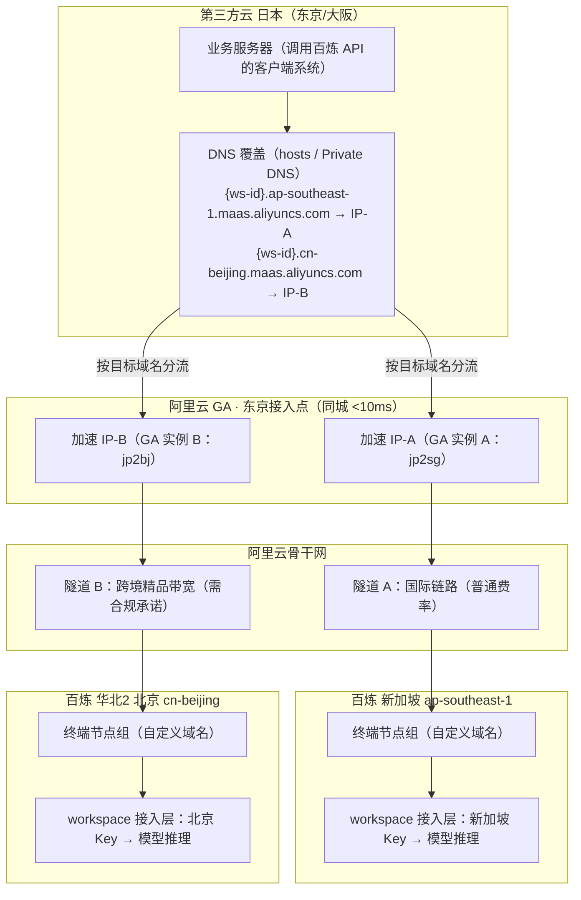

# 百炼 API 跨云/跨境网络接入方案集（Bailian Network Access Solutions）

> 最后更新: 2026-09-01
> 所属厂商: 阿里云
> 产品类别: MaaS
> 文档定位: 售前/交付场景下，第三方云（腾讯云等）或海外客户端调用百炼 API 的网络层方案选型与配置手册
> 覆盖场景: 腾讯云上海→百炼北京（公网/PrivateLink）、腾讯云日本→百炼新加坡/北京（GA 全球加速）、双地域接入

---

## 0. 方案选型决策树（速查）

```
客户端要调用百炼 API，网络层怎么选？
│
├─ 诉求 = "能通就行 / 成本最低"
│    └─▶ 方案 A：公网 HTTPS 直连 + 应用层加固（¥0，当天可用）
│
├─ 诉求 = "安全审计要求流量内网落地，不经公网"
│    ├─ 客户端可迁入阿里云 ──▶ 方案 B1：阿里云 VPC + PrivateLink 公共服务型
│    ├─ 客户端留在第三方云 ──▶ 方案 B2：跨云专线/VPN + PrivateLink
│    │                        └─ B2-plus：workspace 专属 apiserver_url 形态
│    └─ 仅要"加密"而非"内网" ──▶ 其实方案 A 的 TLS + 应用层加密即满足
│
├─ 诉求 = "减少公网抖动对 API 可用性的影响"（高可用）
│    ├─ 先测量（1 周拨测）──▶ 质量好 → 方案 A + 重试加固，收工
│    ├─ 质量差、客户端在海外 ──▶ 方案 C：GA 全球加速（本文重点）
│    └─ 质量差、客户端在国内第三方云 ──▶ GA / 迁调用服务入阿里云 + PrivateLink
│
└─ 诉求 = "海外客户端同时用新加坡+北京两地百炼"
     └─▶ 方案 C3：GA 双实例双隧道 + 客户端双域名覆盖
```

**三条先验结论**（避免走弯路）：

1. **VPN + PrivateLink 治不了公网抖动**——IPsec 隧道只是给公网流量加密，隧道仍跑在同一条公网链路上，抖动丢包一点没少。VPN 解决的是合规（加密/内网落地），不是可用性。
2. **百炼 API 无源 IP 白名单机制**——PrivateLink/GA 带来的纯粹是流量路径收益，鉴权只认 API Key。
3. **抗抖动的性价比之王是应用层重试**——链路瞬时故障率 0.5% 时，2 次指数退避重试即可把客户端感知可用性从 99.5% 提到 99.9999%（0.5% → 0.5%³ = 0.0000125%）。网络层方案（GA/专线）是消除抖动主体，重试兜住残余故障，两层叠加最稳。

---

## 1. 基础知识：百炼接入域名体系

### 1.1 三种接入域名（同一地域内）

| 对比项 | 业务空间专属域名（推荐） | DashScope 域名（存量） | 试用域名 |
|--------|------------------------|----------------------|---------|
| 域名格式 | `{WorkspaceId}.{region}.maas.aliyuncs.com` | `dashscope.aliyuncs.com`（北京）/ `dashscope-intl.aliyuncs.com`（新加坡） | `trial.{region}.maas.aliyuncs.com` |
| 鉴权方式 | **仅访问当前业务空间** | 可访问所有业务空间 | 可访问所有业务空间 |
| 请求超时 | **3600 秒** | 600 秒 | 600 秒 |
| 协议支持 | HTTP、SSE、WebSocket、WebRTC、AOQ | HTTP、SSE、WebSocket | HTTP、SSE |
| SLA | 99.9% | 99.9% | 不提供 |
| 适用 | 生产环境 | 存量兼容，建议迁移 | 快速体验 |

来源: https://www.alibabacloud.com/help/zh/model-studio/regions/

### 1.2 URL 构成拆解（以 workspace 专属端点为例）

```
https://ws-{workspace-id}.cn-beijing.maas.aliyuncs.com/compatible-mode/v1
└─┬─┘  └──────┬──────┘ └───────┬───────┘ └────────┬────────┘
协议    workspace ID    地域(cn-beijing)  OpenAI 兼容固定路径
        (终端节点服务器 = ws-{workspace-id}.cn-beijing.maas.aliyuncs.com)
```

- 客户端只要一个 Base URL → 填完整 `https://{host}/compatible-mode/v1`
- 客户端拆"服务器地址"+"API 路径"两字段 → 地址填 host（不带协议不带路径），路径填 `/compatible-mode/v1`
- SDK 自动追加 `/chat/completions`

### 1.3 地域隔离铁律（最大的坑）

百炼各地域（北京 / 新加坡 / 法兰克福 / 东京 / 香港 / 弗吉尼亚）的 **API Key、workspace、模型列表完全独立，不能跨地域混用**：

- 北京 workspace 的 Key 调新加坡端点 → 直接报错（401/403/模型不存在类）
- 切换地域 = 换一套「workspace 域名 + API Key + 模型清单」三件套，**三者永远成对切换**
- 国际站新加坡节点为 USD 计价口径（与售前材料定价标准一致）

---

## 2. 方案 A：公网直连 + 应用层加固（基线，¥0）

### 2.1 网络前提

- 百炼 API 是公网服务，第三方云（如腾讯云）**直接公网调用即可**，无需专线/白名单报备
- 客户侧安全组出方向放行 TCP 443
- 国内跨云（如上海→北京）公网 RTT 约 20~40ms，相对 LLM 首 token 延迟（数百 ms 起）可忽略

### 2.2 配置三要素

1. **API Key**：百炼控制台 → 切换到目标 workspace → API-Key 管理 → 创建（`sk-` 开头）。Key 归属创建时的 workspace，专属端点必须配该 workspace 自己的 Key
2. **模型权限**：子业务空间需在 Authorization & Throttling Settings 中为目标模型开启调用权限（默认空间无需额外授权）
3. **Base URL**：`https://{workspace-host}/compatible-mode/v1`

### 2.3 快速验证

```bash
curl https://ws-{workspace-id}.cn-beijing.maas.aliyuncs.com/compatible-mode/v1/chat/completions \
  -H "Authorization: Bearer $DASHSCOPE_API_KEY" \
  -H "Content-Type: application/json" \
  -d '{"model": "qwen3.8-max", "messages": [{"role": "user", "content": "你好"}]}'
```

### 2.4 应用层加固清单（抗抖动的核心，¥0）

| 措施 | 做法 | 治什么 |
|------|------|--------|
| 失败快检 + 重试 | connect timeout 设 5s（不要 60s）；建连失败/首 token 前失败立即指数退避重试（1s/2s/4s + 随机抖动），共 2~3 次 | 连接被断、握手卡死 |
| 连接池 + keep-alive | 复用 HTTP/2 长连接，预热连接池 | 每次握手都是最脆弱窗口 |
| 流式重试边界 | 首 token 前失败可透明重试；首 token 后断流按业务决定（续传 or 报错） | 流中断 |
| 双端点兜底 | 配置两组 base_url：workspace 专属域名 + `dashscope.aliyuncs.com`，失败切换 | 单一接入域名故障 |
| 熔断 + 排队 | 持续失败熔断降级，恢复后放量 | 故障放大 |

> LLM 调用是长连接流式请求，"慢"很少致命，"断"才致命——而"断"恰恰是重试最能治愈的。

### 2.5 先测量再决策

部署前跑一周拨测，避免为想象中的问题付费：

```bash
mtr -r -c 100 ws-{workspace-id}.cn-beijing.maas.aliyuncs.com     # 丢包/抖动/路由
curl -o /dev/null -s -w "%{time_connect} %{time_appconnect}\n" \
  https://ws-{workspace-id}.cn-beijing.maas.aliyuncs.com/compatible-mode/v1/models
```

- 丢包 < 0.1%、建连失败率 < 0.1% → 问题不存在，方案 A 收工
- 集中在特定时段/线路 → 尝试调整客户端云厂商出口线路（如 BGP 多线切换）
- 持续质量差 → 进入方案 B/C

---

## 3. 方案 B：PrivateLink 私网接入（合规导向）

### 3.1 两种 PrivateLink 形态

| | B1：公共服务型（自助开通） | B2：专属服务型（apiserver_url） |
|---|--------------------------|------------------------------|
| 终端节点服务 | 阿里云服务列表选 `com.aliyuncs.dashscope` | 百炼为 workspace 交付的专属终端节点服务 |
| 域名格式 | `ep-xxx.dashscope.{region}.privatelink.aliyuncs.com`（含服务名段） | `ep-xxx.{region}.privatelink.aliyuncs.com:8080`（**无服务名段，8080 端口**） |
| 默认域名协议 | 仅 HTTP（明文，API Key 不加密，不建议生产） | 待交付方确认（8080 常为 HTTP） |
| 自定义域名 | `vpc-xxx.{region}.dashscope.aliyuncs.com`，支持 HTTPS（推荐） | — |
| 接入层特性 | DashScope 公共接入层（超时 600s） | 预期保留 workspace 专属接入特性（3600s 超时等，需向交付方确认） |
| Base URL 变化 | 域名替换为终端节点域名，路径 `/compatible-mode/v1` 不变，**API Key 不变** | 同左 |

**关键认知**：走 PrivateLink 后 base_url 不再是 `ws-xxx.maas.aliyuncs.com`，而是终端节点服务域名；B2 形态正是 workspace 专属域名的私网化交付。

### 3.2 B1：公共服务型配置步骤（跨云场景）

**Step 1 跨云网络打通**（三选一）：

| 方式 | 路径 | 适用 | 备注 |
|------|------|------|------|
| 跨云专线 | 第三方云 ↔ 运营商专线 ↔ 阿里云 VPC（与百炼同地域：北京/新加坡） | 生产、合规要求物理隔离 | 成本数千~上万/月，交付 2~4 周 |
| IPsec VPN | 两端 VPN 网关 + 公网加密隧道 | 预算有限 | ⚠️ 隧道经公网，不满足"物理不经公网"口径；治不了抖动 |
| 客户端迁云 | 调用服务部署到阿里云 ECS/FC | 架构允许时的最优解 | 成本 = 一台小 ECS，无专线溢价 |

**Step 2 创建接口终端节点**（阿里云终端节点控制台，地域=百炼服务地域）：

| 参数 | 值 |
|------|-----|
| 终端节点类型 | 接口终端节点 |
| 终端节点服务 | 阿里云服务 → 筛选选中 **`com.aliyuncs.dashscope`** |
| 自定义服务域名 | **开启**（获得 HTTPS 域名 `vpc-xxx.{region}.dashscope.aliyuncs.com`） |
| 专有网络 | 中转 VPC |
| 可用区与交换机 | **至少 2 个不同可用区**（高可用） |
| 安全组 | 入方向放行 **80/443**，源=客户端网段 |

**Step 3 客户端改造**：base_url 域名替换为终端节点域名，Key 不变：

```python
client = OpenAI(
    api_key=os.getenv("DASHSCOPE_API_KEY"),
    base_url="https://vpc-xxx.cn-beijing.dashscope.aliyuncs.com/compatible-mode/v1",
)
```

**跨地域变体**：客户端 VPC 与百炼不同地域时——同境内跨地域用"启用跨地域端点"（CDT 结算，内地互通默认 1000 Mbps）；跨境（内地↔境外）须 CEN 跨地域 VPC 互通（需提交申请，1~2 工作日审批）。

### 3.3 B2：专属服务型（apiserver_url）配置要点

交付物形态：`apiserver_url = ep-xxx.{region}.privatelink.aliyuncs.com:8080`（已确认支持）。

与 B1 的配置差异：
- 终端节点指向**百炼交付的专属终端节点服务**（非 `com.aliyuncs.dashscope`）
- 安全组入方向放行 **TCP 8080**（不是 80/443）
- 客户端 base_url：`http(s)://ep-xxx.{region}.privatelink.aliyuncs.com:8080/compatible-mode/v1`（协议与路径拼接以交付文档为准，curl 5 分钟可探测确认）

落地前必须向交付方确认 4 件事：
1. 8080 上是 HTTP 还是 HTTPS（HTTP 则 API Key 明文，安全团队需知悉）
2. 路径拼接规则（`+ /compatible-mode/v1` 还是 `+ /v1`）
3. 专属特性（3600s 超时/并发承载/SLA）是否保留
4. 实际地域端点（如 workspace 在北京，apiserver_url 应为 cn-beijing 形态）

### 3.4 方案 B 的取舍提醒

| 维度 | 专属域名（公网） | PrivateLink B1（DashScope 私网接入层） |
|------|----------------|--------------------------------------|
| 网络路径 | 公网 | 阿里云内网全程 |
| 请求超时 | 3600 秒 | **600 秒**（长流式场景注意） |
| 协议 | HTTP/SSE/WebSocket/WebRTC/AOQ | HTTP/SSE/WebSocket |
| 限流额度 | 主账号维度合并 | 主账号维度合并（不受影响） |

若客户必须"专属域名特性 + 私网"双重需求 → 走 B2（apiserver_url）形态。

---

## 4. 方案 C：GA 全球加速（抗公网抖动首选，海外客户端场景）

### 4.1 原理与价值

GA 把"客户端→百炼"之间**质量不可控的国际/跨云公网段**替换为"就近接入阿里云加速网络 + 阿里骨干网智能路由"：

- 日本客户端同城进入东京接入点（<10ms），跨境/跨域段走阿里骨干网
- 与公网的国际转接抖动彻底隔离，TCP 建连时间与抖动方差显著收窄
- 按量付费（实例费 + CU 费 + CDT 流量费），小额起步，无前期投入

### 4.2 三个场景的配置矩阵

| 配置项 | C1：日本→新加坡 | C2：日本→北京 | C3：双地域（新加坡+北京） |
|--------|----------------|--------------|------------------------|
| GA 实例 | 标准型·按量 ×1 | 标准型·按量 ×1 | **标准型·按量 ×2**（双隧道） |
| 加速区域 | 日本（东京） | 日本（东京） | 两实例均日本（东京），各得一个加速 IP |
| 监听 | TCP · 443 | TCP · 443 | 各配 TCP · 443 |
| 终端节点组地域 | 新加坡 | 华北2（北京） | 分别配新加坡 / 北京 |
| 终端节点（自定义域名） | `{ws-id}.ap-southeast-1.maas.aliyuncs.com` | `{ws-id}.cn-beijing.maas.aliyuncs.com` | 同左，两套 |
| API Key | **新加坡地域 Key** | **北京地域 Key** | 两套 Key，与域名成对 |
| 跨境合规承诺 | **不需要**（海外→海外） | **需要**（勾选，默认精品带宽跨境） | 仅北京腿需要 |
| 流量费率 | 国际普通费率 | 跨境精品带宽费率（更高） | 两腿分别计费 |

### 4.3 关键设计决策（三条铁律）

1. **监听协议必须选 TCP，不能用 HTTPS 监听**
   GA 的 HTTPS 监听要在 GA 侧终结 TLS（需上传域名证书），而百炼域名的证书在阿里云侧、客户拿不到。TCP 监听是四层透明转发，SNI/证书校验在客户端与百炼之间端到端原生完成，客户端零改造。
2. **终端节点用"自定义域名"类型，值填百炼 workspace 域名**
   GA 动态解析该域名，不怕百炼侧 IP 变化。终端节点组地域选择百炼服务地域（新加坡/北京）。
3. **C3 必须两个 GA 实例，不能一个实例加两条规则**
   - GA 监听按"协议+端口"区分，两个后端都是 443，一个实例放不下两个监听；绕过需客户端改非标端口（得不偿失）
   - TCP 透传无 Host/SNI 分流能力，无法按目标域名路由到不同终端节点组
   - 百炼两地域 Key/域名/模型本来就隔离，天然需要两套独立配置

### 4.4 架构图（C3 双地域形态，涵盖 C1/C2 单腿子集）



同一个客户端、同一台机器，同时挂两条隧道——**按目标域名自动分流**，互不影响、独立故障域。

### 4.5 GA 侧配置步骤（单腿通用，双地域执行两遍）

1. **创建实例**：全球加速控制台 → 创建标准型按量付费实例（首次使用先开通按量付费 GA）
2. **加速区域**：日本（东京）；带宽峰值 10~50 Mbps 起步（仅限速，LLM 文本流量极小；多模态传图再调大；**设过低会限速丢包**）；IPv4；BGP 多线 → **记录加速 IP**
3. **监听**：智能路由；协议 **TCP**；端口 **443**
4. **终端节点组**：地域选百炼服务地域；后端服务类型**自定义域名**；后端服务填 workspace 域名；权重 255
   - 北京腿：向导中出现**数据跨境合规承诺**，勾选同意（默认精品带宽跨境，无需申请联通跨境资质）
   - 新加坡腿：无合规弹窗，直接提交
5. 实例创建约 3~5 分钟

> 精品带宽跨境 vs 专线跨境：前者开箱即用（勾承诺即走）；后者质量更高但需申请联通跨境资质。先用精品带宽实测，不达标再升级。

### 4.6 客户端上层路由策略（双隧道之上）

| 策略 | 做法 | 适用 |
|------|------|------|
| 静态分流 | 需北京独有模型的应用配 BJ 域名+Key，其余 SG | 模型需求固定，最简单 |
| 主备容灾 | SG 主（无跨境依赖、费率低）BJ 备；切换时**域名+Key 成对切** | 可用性优先 |
| 按模型路由 | 路由层查"模型→地域"映射表 | 两地域模型清单有差异 |
| 双活/成本优化 | 按两地计费与限流动态分配 | 有成本运营诉求 |

进阶可选：终端节点组内挂多个终端节点（主 = workspace 专属域名，备 = 同地域 `dashscope(-intl).aliyuncs.com` 公共域名，同 Key）做地域内后端冗余；自定义域名终端节点的健康检查行为建议先小流量实测。自动化切换可参考本目录 `dashscope_multi_account_router.py` 的健康检查+权重轮询模式，把"多账号"换成"多地域"。

---

## 5. 客户端配置四法（GA 加速 IP 的落地接入）

### 5.1 原理与第一铁律

GA 加速 IP 是"替身入口"：**TLS/SNI/证书校验/API Key/路径全部照旧，唯独 TCP 连接落点换成 GA 加速 IP**。客户端全部工作量 = 让百炼域名在本端解析到加速 IP。

> ⚠️ **base_url 里绝不能直接填 IP**——TLS 握手时 SNI 是 IP、证书域名对不上，直接握手失败。**base_url 域名原样保留，只在"域名→IP 解析"层做文章。**

### 5.2 四种方式速查

| 方式 | 改哪里 | 适用 | 生效范围 |
|------|--------|------|---------|
| ① `/etc/hosts` | 每台服务器本地文件 | PoC / ≤10 台 | 单机 |
| ② 云厂商 Private DNS | 控制台零代码 | **生产推荐** | 整个 VPC |
| ③ 应用代码级 | Python/Go 代码 | 改不了系统层 | 单进程 |
| ④ 出口正向代理 | VPC 内 squid | 客户端是黑盒 | 走代理的所有客户端 |

### 5.3 方式①：/etc/hosts（回滚最快）

```bash
sudo tee -a /etc/hosts << 'EOF'
<IP-A>  {ws-id}.ap-southeast-1.maas.aliyuncs.com
<IP-B>  {ws-id}.cn-beijing.maas.aliyuncs.com
EOF
# 验证：ping 返回加速 IP 即生效；出问题删掉两行立刻回公网直连
```

容器注意：Docker 用 `--add-host` / compose `extra_hosts`；K8s 用 Pod `hostAliases` 或 CoreDNS hosts 插件。

### 5.4 方式②：云厂商 Private DNS（腾讯云示例，生产推荐）

1. 腾讯云控制台 → 私有域解析 Private DNS → 创建私有域
2. **私有域名称直接填完整域名**（精确命中，不要填 `maas.aliyuncs.com` 大 zone）：
   - 私有域 1：`{ws-id}.ap-southeast-1.maas.aliyuncs.com` → A 记录（`@`）→ `<IP-A>`
   - 私有域 2：`{ws-id}.cn-beijing.maas.aliyuncs.com` → A 记录（`@`）→ `<IP-B>`
3. 关联客户端所在 VPC → 保存
4. 验证：VPC 内 `dig +short {域名}` 返回加速 IP

前提：VPC DNS 保持云厂商默认内网 DNS；客户端进程未自建 DNS。

### 5.5 方式③：应用代码级

**Python（进程级 monkey-patch，OpenAI SDK/requests/httpx 通吃）**：

```python
import socket

DNS_OVERRIDE = {
    "{ws-id}.ap-southeast-1.maas.aliyuncs.com": "<IP-A>",
    "{ws-id}.cn-beijing.maas.aliyuncs.com": "<IP-B>",
}
_orig = socket.getaddrinfo
socket.getaddrinfo = lambda host, *a, **k: _orig(DNS_OVERRIDE.get(host, host), *a, **k)
# 在创建任何 HTTP 客户端之前执行；base_url 域名原样
```

**Go（自定义 DialContext）**：

```go
var dnsOverride = map[string]string{
    "{ws-id}.ap-southeast-1.maas.aliyuncs.com": "<IP-A>",
    "{ws-id}.cn-beijing.maas.aliyuncs.com":      "<IP-B>",
}
transport := &http.Transport{
    DialContext: func(ctx context.Context, network, addr string) (net.Conn, error) {
        host, port, _ := net.SplitHostPort(addr)
        if ip, ok := dnsOverride[host]; ok {
            addr = net.JoinHostPort(ip, port)
        }
        return (&net.Dialer{Timeout: 5 * time.Second}).DialContext(ctx, network, addr)
    },
}
```

### 5.6 方式④：出口正向代理（黑盒客户端）

VPC 内搭 squid 正向代理（支持 HTTPS CONNECT 隧道），代理机 hosts 写域名覆盖，客户端仅设：

```bash
export HTTPS_PROXY=http://<代理机内网IP>:3128
export NO_PROXY=localhost,127.0.0.1
```

绝大多数 SDK/运行时原生认 `HTTPS_PROXY`；域名解析、分流、换 IP 全部收敛到代理机一处。

---

## 6. 验证与排错手册

### 6.1 标准验证流程

```bash
# 1. 解析验证：域名指向加速 IP（GA 方案）
dig +short {ws-id}.ap-southeast-1.maas.aliyuncs.com     # 期望 <IP-A>

# 2. 链路验证（curl --resolve 旁路测试，不动任何配置）：
curl --resolve {ws-id}.ap-southeast-1.maas.aliyuncs.com:443:<IP-A> \
  https://{ws-id}.ap-southeast-1.maas.aliyuncs.com/compatible-mode/v1/chat/completions \
  -H "Authorization: Bearer $DASHSCOPE_API_KEY_SG" \
  -H "Content-Type: application/json" \
  -d '{"model":"qwen3.8-max","messages":[{"role":"user","content":"你好"}]}'

# 3. 效果对比：直连 vs GA 各 50 次，看 time_connect 均值与尾部抖动（max-p50）
for i in $(seq 50); do
  curl -o /dev/null -s -w "%{time_connect} %{time_appconnect}\n" \
    https://{ws-id}.ap-southeast-1.maas.aliyuncs.com/compatible-mode/v1/models
done
```

### 6.2 排错速查表

| 现象 | 原因 | 处理 |
|------|------|------|
| 401/403/模型不存在 | **Key 与域名跨地域配错对**（北京 Key 打新加坡端点，或反之）；或 workspace 未授权该模型 | 核对「域名+Key+模型清单」三件套成对 |
| 连 GA 加速 IP 超时 | 加速区域选错 / 带宽峰值过低限速 / 安全组未放行 | 核对加速区域、带宽、终端节点安全组（GA: 443；PrivateLink B1: 80/443；B2: **8080**） |
| TLS 握手失败、证书报错 | GA 误用 HTTPS 监听（GA 终结 TLS 但没有百炼证书）；或 base_url 直接填了 IP | 改回 **TCP 监听**；base_url 保留域名 |
| DNS 解析失败 | 客户端侧未配覆盖（hosts/Private DNS） | 见第 5 章 |
| PrivateLink 默认域名 + HTTPS 报错 | `ep-*.dashscope.*.privatelink` 默认域名仅支持 HTTP | 换自定义服务域名 `vpc-xxx` |
| 429 Throttling | RPM/TPM 限流（与网络无关） | 控制台查额度，提额 |
| 长流式请求 600s 断开 | DashScope 接入层超时上限（PrivateLink B1 公共接入层） | 客户端拆分长任务或走 B2 专属形态确认 |
| 偶发断流 | GA 连接空闲超时（长思考模型长时间不吐 token） | 客户端 keep-alive/心跳，或调大监听空闲超时 |
| 双隧道一条通一条 401 | Key 和域名跨腿配错 | 见第一行 |
| QwQ 类推理模型非流式调用超时 | 该类模型仅支持流式 | 请求设 `stream=true` |

---

## 7. 方案计费对比总表

| 方案 | 月成本量级 | 治抖动 | 合规（不经公网） | 交付周期 |
|------|-----------|--------|----------------|---------|
| A 公网直连+重试 | ¥0 | 兜底（应用层） | ❌（但 TLS 加密） | 即刻 |
| B1 PrivateLink 公共服务型 + VPN | ~几百 | ❌ | ⚠️ 隧道经公网（一般审计认，严格口径不认） | 1~3 天 |
| B1 PrivateLink + 专线 | 数千~上万 | ✅ | ✅ 物理隔离 | 2~4 周 |
| B2 PrivateLink apiserver_url + 专线 | 数千~上万（专线是大头） | ✅ | ✅ 且保留专属接入特性 | 2~4 周 |
| **C GA（日本→新加坡）** | **按量小额起步** | ✅ 海外段进骨干网 | ❌（仍经公网接入点，但路径受控） | 半天 |
| **C GA（日本→北京）** | 按量（跨境精品费率较高） | ✅ | ❌ 同上 | 半天 |
| C3 GA 双地域 | 两份按量 | ✅ | ❌ 同上 | 半天 |

> GA 各形态流量费由 CDT 结算：日本→新加坡为国际普通费率；日本→北京为跨境精品带宽费率（更高）。纯文本 LLM 调用流量极小（单次往返 10~50 KB），月成本可控；多模态大图/视频场景需预估。

---

## 8. 客户交付清单（Checklist）

**我方（阿里侧/售前）提供：**
- [ ] GA 加速 IP（IP-A/IP-B）与两条域名的一一对应表
- [ ] GA 实例配置就绪确认（加速区域/监听/终端节点组）
- [ ] 验证命令与预期返回（见 6.1）

**客户（调用方）执行：**
1. [ ] 确认客户端系统形态：ECS 直跑 / 容器（K8s？）/ 自建 DNS → 选第 5 章方式①~④（生产推荐 Private DNS，PoC 用 hosts）
2. [ ] 按选定方式做域名→加速 IP 覆盖
3. [ ] 配置两套「base_url + 地域 Key」（如 `DASHSCOPE_API_KEY_SG` / `DASHSCOPE_API_KEY_BJ`，**域名和 Key 成对**）
4. [ ] 跑验证三连：解析指向加速 IP / TLS 握手成功 / API 返回 200
5. [ ] 先 1~2 台机器试跑一周（time_connect 均值 + 尾部抖动达标）→ 再全量
6. [ ] 保留回滚路径：删覆盖配置即回公网直连，GA 资源留着无副作用

---

## 9. 参考资料

- 选择地域、服务部署范围和接入域名: https://www.alibabacloud.com/help/zh/model-studio/regions/
- 通过终端节点私网访问百炼 API（PrivateLink）: https://help.aliyun.com/zh/model-studio/access-model-studio-through-privatelink
- 配置全球加速实现加速访问指定域名的后端服务: https://help.aliyun.com/zh/ga/getting-started/accelerate-transmission-of-network-traffic-destined-for-a-specified-domain-name
- 全球加速购买与选型建议: https://help.aliyun.com/zh/ga/product-overview/select-and-purchase-ga-resources
- 终端节点组（自定义域名终端节点）: https://help.aliyun.com/zh/ga/user-guide/overview-4/
- 百炼业务空间权限管理指南（本地）: `../model_studio_config/model-studio-workspace-permission-guide.md`
- 百炼安全合规（本地，含 PrivateLink/加密调用）: `../model_studio_security-compliance_cn.md`
- Qwen 模型知识（本地）: `../qwen.md`

## Changelog

| 日期 | 变更内容 |
|------|----------|
| 2026-09-01 | 初版：沉淀跨云/跨境调用百炼 API 网络方案全集——接入域名体系与地域隔离铁律；方案 A（公网直连+应用层加固，含重试可用性数学）；方案 B（PrivateLink 公共服务型/专属 apiserver_url 两种形态及跨云打通方式）；方案 C（GA 全球加速：日本→新加坡/日本→北京/双地域双隧道三场景配置矩阵，TCP 监听铁律）；客户端 DNS 覆盖四法（hosts/Private DNS/代码级/正向代理）；验证排错手册与计费对比。客户标识已脱敏（`{ws-id}` 占位） |
