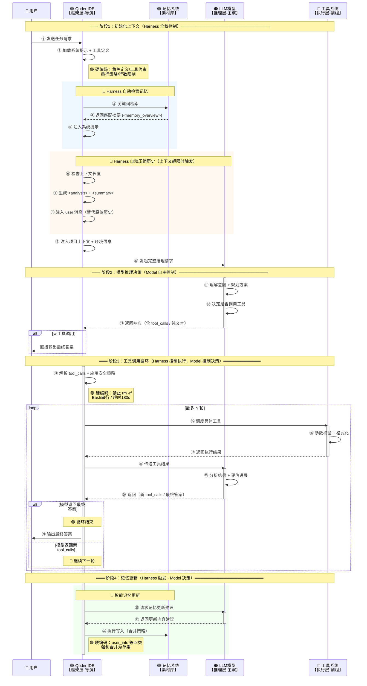

# Qoder IDE 深度调研报告

> 基于三轮真实日志（qoder_log_20260622.txt）的逆向工程分析
> 
> 调研日期：2026-06-22 | 分析对象：Qoder IDE（Agent = Model + Harness 架构）


## 一、架构全景图

```
┌─────────────────────────────────────────────────────────────────────────┐
│                           用户交互层                                    │
│                       👤 自然语言指令输入                               │
└────────────────────────────┬────────────────────────────────────────────┘
                             ▼
┌─────────────────────────────────────────────────────────────────────────┐
│                       🟢 Qoder IDE (Harness 框架层)                    │
│  ┌──────────────────┐ ┌──────────────────┐ ┌────────────────────────┐  │
│  │   上下文管理      │ │    记忆系统       │ │   工具调度与执行引擎   │  │
│  │  ·系统提示拼接    │ │  ·自动检索        │ │  ·并行/串行策略       │  │
│  │  ·历史摘要压缩    │ │  ·智能合并        │ │  ·安全护栏            │  │
│  │  ·环境注入       │ │  ·持久化存储      │ │  ·超时控制            │  │
│  └──────────────────┘ └──────────────────┘ └────────────────────────┘  │
│                              │                                          │
│                        工具调用协议                                     │
└────────────────────────────┬────────────────────────────────────────────┘
                             ▼
┌─────────────────────────────────────────────────────────────────────────┐
│                       🟠 LLM 模型 (推理层)                             │
│  ┌──────────────────────────────────────────────────────────────────┐  │
│  │   核心能力：意图理解 → 任务规划 → 工具决策 → 结果整合 → 生成    │  │
│  └──────────────────────────────────────────────────────────────────┘  │
│  约束：上下文窗口（模型决定）· 推理精度 · 工具选择自主权               │
└────────────────────────────┬────────────────────────────────────────────┘
                             ▼
┌─────────────────────────────────────────────────────────────────────────┐
│                       🔵 工具系统 (执行层)                             │
│  ┌────────────┐  ┌────────────┐  ┌────────────┐  ┌──────────────────┐  │
│  │ Read/Write │  │   Bash     │  │   Search   │  │  SearchReplace   │  │
│  │  文件操作   │  │  命令执行  │  │   检索     │  │   代码编辑       │  │
│  └────────────┘  └────────────┘  └────────────┘  └──────────────────┘  │
│  硬编码护栏：串行策略 · 超时控制 · 行数限制 · rm -rf 拦截               │
└─────────────────────────────────────────────────────────────────────────┘
```


## 二、核心概念：Agent = Model + Harness

```
┌─────────────────────────────────────────────────────────────────────────┐
│                    Agent = Model + Harness                             │
├─────────────────────────────────────────────────────────────────────────┤
│                                                                         │
│   🧠 Model（主演）                      ⚙️ Harness（导演）              │
│   ────────────────                      ─────────────────               │
│   · 理解用户意图                         · 管理上下文（喂料）            │
│   · 规划任务步骤                         · 检索记忆（长期记忆）          │
│   · 决策工具与参数                       · 压缩历史（防窗口溢出）        │
│   · 分析工具结果                         · 调度工具（执行动作）          │
│   · 生成最终答案                         · 施加护栏（安全刹车）          │
│   · 决定何时停止                         · 记录日志（可观测性）          │
│                                                                         │
│   └───── 工具调用协议（tool_calls + role="tool"）─────┘                 │
│                                                                         │
│   核心闭环：思考（Model）→ 行动（Harness）→ 观察（Model）→ 循环        │
│   最终输出：自然语言答案 + 代码修改 + 文件操作 + 命令执行               │
│                                                                         │
└─────────────────────────────────────────────────────────────────────────┘
```


## 三、完整调用时序图（最终优化版）




## 四、时序图关键要素说明

### 4.1 硬编码护栏（图中 🟢 标注）

| **序号** | **硬编码项** | **具体值** | **日志证据** |
|---------|------------|-----------|------------|
| ② | 系统提示词固定模板 | 角色定义 + 通信规范 + 工具规则 | 片段1/2/3 的 `system` 消息 |
| ② | 工具定义与限制 | 串行/并行/超时 | 系统提示中工具定义部分 |
| ② | SearchReplace 行数限制 | ≤600 行 | 系统提示明文 |
| ② | Write 文件行数限制 | ≤1000 行 | 系统提示明文 |
| ② | Bash 命令长度限制 | ≤500 字符 | 系统提示明文 |
| ② | Glob/Grep 结果上限 | ≤2000 条 | 系统提示明文 |
| ⑭ | 禁止 rm -rf | 硬禁止 | `no-rm-rf.md` 规则 |
| ⑭ | Bash 强制串行 | 禁止并行 | `<maximize_parallel_tool_calls>` |
| ⑭ | 文件编辑强制串行 | 禁止并行 | 系统提示明文 |
| ⑭ | Bash 超时时间 | 默认 180s（最大 1800s） | 工具参数定义 |
| ⑭ | 禁止 git --force | 硬禁止 | `protect-api-keys.md` 规则 |
| ㉔ | 记忆强制合并 | user_info 等四类各限 1 条 | `UpdateMemory` 工具定义 |
| ⑳ | 最大循环轮次 | **待确认**（未在日志明文出现） | 基于通用架构推断 |

### 4.2 记忆检索机制（🔵 高亮块，步骤③→⑤）

| **动作** | **执行方** | **模型可见性** |
|---------|-----------|--------------|
| ③ 关键词检索 | Harness 自动 | ❌ 不可见（后台执行） |
| ④ 返回匹配摘要 | Memory → Harness | ❌ 不可见（后台执行） |
| ⑤ 注入系统提示 | Harness → Model | ✅ 可见（`<memory_overview>` 标签） |

**关键洞察**：检索过程对模型完全透明，模型只看到检索结果。

### 4.3 历史摘要压缩机制（🟡 高亮块，步骤⑥→⑧）

| **动作** | **执行方** | **触发条件** |
|---------|-----------|------------|
| ⑥ 检查上下文长度 | Harness | 每轮请求前自动检测 |
| ⑦ 生成 `<analysis>` + `<summary>` | Harness | 上下文即将超限时自动触发 |
| ⑧ 注入 user 消息 | Harness → Model | 压缩后替代原始对话历史 |

**日志证据**：
- 片段1（首轮）：无摘要
- 片段2/3（后续轮次）：包含 `<analysis>` + `<summary>` 完整压缩块


## 五、角色职责矩阵

| **维度** | **🟢 Qoder IDE (Harness)** | **🟠 LLM 模型** |
|---------|---------------------------|----------------|
| **核心定位** | 导演 + 制片人 | 主演 |
| **职责** | 搭建舞台、准备剧本、调度剧务、安全控场 | 理解角色、即兴表演、做出决策 |
| **硬编码** | ✅ 有（行数限制/超时/禁止 rm -rf） | ❌ 无（仅受上下文窗口限制） |
| **工具决策** | ❌ 不干预（只提供工具列表） | ✅ 自主决定（是否调、调哪个、填什么参数） |
| **工具执行** | ✅ 全权负责（调度/校验/超时/结果回传） | ❌ 不执行（只生成调用指令） |
| **记忆管理** | ✅ 自动检索 + 执行写入 | ⚠️ 参与内容提炼（UpdateMemory 决策） |
| **上下文管理** | ✅ 全权负责（检索/压缩/注入） | ❌ 被动接收（但会利用注入的信息） |
| **循环控制** | ✅ 全权负责（最大轮次/超时） | ❌ 不控制（模型可以返回新的 tool_calls，但能否继续由 Harness 决定） |
| **可观测性** | ✅ 全权负责（日志/监控/审计） | ❌ 不参与（模型不写日志） |


## 六、硬编码护栏清单（来源分类）

| **分类** | **硬编码项** | **来源** |
|---------|------------|----------|
| **文件编辑** | SearchReplace ≤600行 / Write ≤1000行 | ✅ 日志明文（系统提示） |
| **命令执行** | Bash ≤500字符 / 超时180s / 强制串行 | ✅ 日志明文（系统提示+工具定义） |
| **结果限制** | Glob/Grep ≤2000条 / 记忆 fetch ≤5条 | ✅ 日志明文（工具定义） |
| **安全策略** | 禁止 rm -rf / git --force / 跳过 hooks | ✅ 日志明文（规则文件） |
| **记忆管理** | user_info 等四类强制合并为单条 | ✅ 日志明文（工具定义） |
| **循环控制** | 最大工具调用轮次（具体值待确认） | ❌ 日志未明文（基于通用架构推断） |
| **工具结果截断** | 超长内容截断阈值（具体值待确认） | ⚠️ 日志有描述但无硬数字 |


## 七、关键洞察

### 洞察1：Qoder IDE 本质是“模型能力放大器”

| **无 Qoder** | **有 Qoder** |
|------------|------------|
| LLM 只能“说”（生成文本） | LLM 能“做”（操作文件、运行命令、修改代码） |
| 单次对话，无记忆 | 跨会话记忆自动检索 |
| 上下文窗口固定 | 智能历史压缩，避免超限 |
| 无工具支持 | 完整工具系统（文件/命令/检索/代码编辑） |

### 洞察2：Harness 的智能体现在“信息管理”

| **能力** | **用户感知** | **技术难度** |
|---------|------------|------------|
| 记忆自动检索 | 低（无感知） | 高（语义匹配+树形索引） |
| 历史摘要压缩 | 低（无感知） | 高（高质量摘要生成） |
| 上下文注入 | 低（无感知） | 中（固定模板） |
| 工具调度 | 中（可见执行过程） | 中（并行/串行策略） |

**结论**：Harness 越“聪明”，用户感知越“自然”——这正是好基础设施的特征。

### 洞察3：模型不可替代的核心能力

| **能力** | **Harness 能否替代** | **原因** |
|---------|-------------------|----------|
| 意图理解 | ❌ 不能 | 只有 LLM 能解析自然语言的深层含义 |
| 任务规划 | ❌ 不能 | 复杂任务拆解需要推理能力 |
| 工具选择 | ❌ 不能 | 哪个工具更适合当前场景，需模型判断 |
| 参数填充 | ❌ 不能 | 需要从上下文中提取具体值并填入 |
| 结果分析 | ❌ 不能 | 工具返回的数据需模型解读 |
| 代码生成 | ❌ 不能 | 需要模型的理解与创造能力 |

**结论**：Harness 再强，也无法替代模型的“智力”。两者是共生关系。

### 洞察4：硬编码是“必要的恶”

| **类型** | **目的** | **风险** |
|---------|---------|----------|
| 安全护栏（禁止 rm -rf） | 防止模型误删文件 | 限制极低，可接受 |
| 稳定性护栏（超时 180s） | 防止命令永久卡死 | 可能影响长任务 |
| 上下文压缩（历史摘要） | 防止窗口溢出 | 摘要可能丢失细节 |
| 文件大小限制（600行） | 防止单次编辑过大 | 大文件需分多次操作 |

**Qoder 的平衡策略**：**用系统提示（软约束）覆盖大部分场景，用硬编码（硬约束）兜底极端情况**。

### 洞察5：Qoder 的进化方向

| **方向** | **当前状态** | **优化建议** |
|---------|------------|------------|
| 记忆检索 | 关键词匹配 + 树形索引 | 引入向量检索，提升语义匹配精度 |
| 历史压缩 | 固定策略（analysis + summary） | 按任务类型自适应压缩策略 |
| 工具调度 | 简单串行/并行策略 | 智能优先级调度（如先读后写） |
| 硬编码阈值 | 固定值（600行/180s） | 根据任务复杂度动态调整 |
| 可观测性 | request_id + usage 追踪 | 增加 TTFT（首 token 耗时）等细粒度指标 |


## 九、核心术语速查表

| **术语** | **定义** | **在 Qoder 中的实现** |
|---------|---------|-------------------|
| **Harness** | Agent 框架层，负责上下文管理、工具执行、流程控制 | Qoder IDE 本身 |
| **Model** | 大语言模型，负责理解、推理、决策、生成 | GLM-5.2（示例日志中的模型） |
| **Tool Calls** | 模型返回的“工具调用”指令 | `tool_calls` 数组（含工具名+参数） |
| **工具执行** | Harness 实际执行工具并返回结果 | `role="tool"` 消息回传 |
| **记忆检索** | Harness 自动检索匹配记忆 | `<memory_overview>` 标签注入 |
| **历史摘要** | Harness 压缩超长上下文 | `<analysis>` + `<summary>` 注入 |
| **硬编码护栏** | Harness 施加的安全与稳定性约束 | 行数限制/超时/禁止 rm -rf |
| **上下文注入** | Harness 在请求前注入的信息 | 系统提示 + 记忆 + 环境 + 工具定义 |


## 十、一句话总结

> **Qoder IDE 通过 `Agent = Model + Harness` 架构，将 LLM 从“只会说的聊天机器人”升级为“既能想又能做的 AI 程序员”——Model 负责“智力”（理解、规划、决策、创造），Harness 负责“执行力”（信息管理、工具调度、流程控制、安全护栏），二者通过工具调用协议协同工作，缺一不可。**

---

**报告结束**